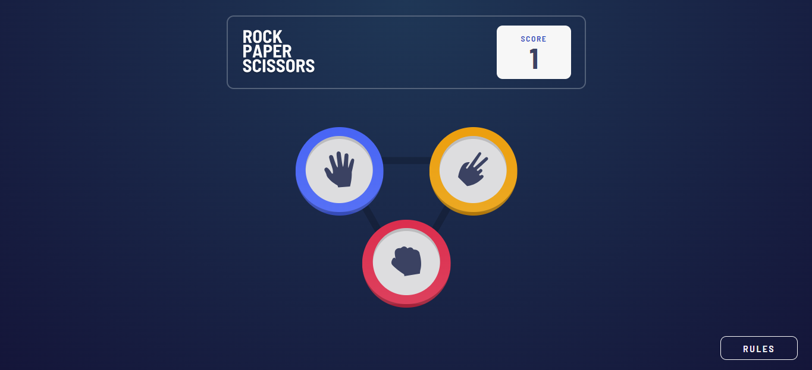

# Frontend Mentor - Rock, Paper, Scissors solution

This is a solution to the [Rock, Paper, Scissors challenge on Frontend Mentor](https://www.frontendmentor.io/challenges/rock-paper-scissors-game-pTgwgvgH). Frontend Mentor challenges help you improve your coding skills by building realistic projects. 

## Table of contents

- [Overview](#overview)
  - [The challenge](#the-challenge)
  - [Screenshot](#screenshot)
  - [Links](#links)
- [My process](#my-process)
  - [Built with](#built-with)
  - [What I learned](#what-i-learned)
  - [Continued development](#continued-development)
  - [Useful resources](#useful-resources)
- [Author](#author)
- [Acknowledgments](#acknowledgments)

## Overview

### The challenge

Users should be able to:

- View the optimal layout for the game depending on their device's screen size
- Play Rock, Paper, Scissors against the computer
- Maintain the state of the score after refreshing the browser _(optional)_
- **Bonus**: Play Rock, Paper, Scissors, Lizard, Spock against the computer _(optional)_

### Screenshot

### Links

- Solution URL: [Solution](https://github.com/MohamDah/rock-paper-scissors)
- Live Site URL: [Site](https://mohamdah-rock-paper-scissors.netlify.app/)

## My process

### Built with

- Semantic HTML5 markup
- CSS custom properties
- Flexbox
- Mobile-first workflow
- [React](https://reactjs.org/) - JS library

### What I learned

At first, this project seemed very daunting. I've always had trouble with CSS, so I was a bit scared looking at the design. But then I spent time breaking it down and thinking through how I would implement things one by one made it a lot easier. I learned a lot about CSS design and transitions. The logic was also a bit confusing at times, but fortunately I didn't have a lot of trouble with it.

### Continued development

I definetly have a ways to go in writing clean code. I always feel like I could have wrote this in a more concise and efficient way, but then I would have to refactor my code from the ground up, possibley introductin new bugs. So I'll try to think about what's the best way to write this to reduce redundancy and inefficiency.

### Useful resources

- [MDN Web Docs](https://developer.mozilla.org/en-US/) - This of course.
- [stackoverflow](https://stackoverflow.com/) - And this.

## Author

- Website - [Mohamed Dahab](mohamdah.netlify.app)
- Frontend Mentor - [@MohamDah](https://www.frontendmentor.io/profile/MohamDah)
- Linkedin - [Mohamed Dahab](https://www.linkedin.com/in/mohamdah/)
